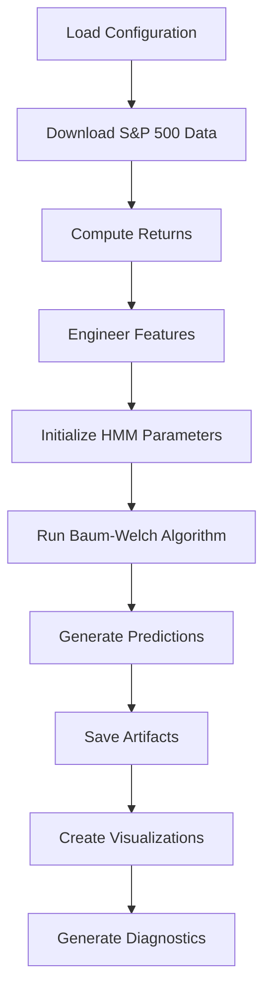

# Architecture Documentation

## Overview

This document describes the architecture and mathematical foundations of the Regime Lab framework for S&P 500 regime detection using Student-t Hidden Markov Models.

## Mathematical Framework

### Hidden Markov Model Structure

The HMM is defined by the tuple `(π, A, B)` where:

- **π**: Initial state probability vector `[π₀, π₁]` where `πᵢ = P(S₀ = i)`
- **A**: Transition probability matrix `A[i,j] = P(Sₜ₊₁ = j | Sₜ = i)`
- **B**: Emission probability distributions `B[i] = P(Oₜ | Sₜ = i)`

For our 2-state model:
```
π = [π₀, π₁]ᵀ
A = [[a₀₀, a₀₁],
     [a₁₀, a₁₁]]
```

### Student-t Emission Distributions

Each state has a Student-t emission distribution with diagonal covariance:

**State 0 (Low Volatility Regime)**:
- Mean: `μ₀ = [μ₀₁, μ₀₂]ᵀ`
- Scale: `σ₀ = [σ₀₁, σ₀₂]ᵀ` (diagonal)
- Degrees of freedom: `ν = 5.0` (fixed)

**State 1 (High Volatility Regime)**:
- Mean: `μ₁ = [μ₁₁, μ₁₂]ᵀ`
- Scale: `σ₁ = [σ₁₁, σ₁₂]ᵀ` (diagonal)
- Degrees of freedom: `ν = 5.0` (fixed)

The Student-t probability density function for dimension `d` is:
```
f(x) = Γ((ν+d)/2) / (Γ(ν/2) * (πν)^(d/2) * |Σ|^(1/2)) * 
       (1 + (1/ν)(x-μ)ᵀΣ⁻¹(x-μ))^(-(ν+d)/2)
```

For diagonal covariance, this simplifies to:
```
f(x) = ∏ᵢ₌₁ᵈ Γ((ν+1)/2) / (Γ(ν/2) * (πν)^(1/2) * σᵢ) * 
       (1 + (1/ν)((xᵢ-μᵢ)/σᵢ)²)^(-(ν+1)/2)
```

### Baum-Welch Algorithm

The Baum-Welch algorithm iteratively updates parameters to maximize the likelihood:

#### Forward-Backward Algorithm

**Forward probabilities**:
```
αₜ(i) = P(O₁,...,Oₜ, Sₜ = i | λ)
α₁(i) = πᵢ * bᵢ(O₁)
αₜ₊₁(j) = [∑ᵢ αₜ(i) * aᵢⱼ] * bⱼ(Oₜ₊₁)
```

**Backward probabilities**:
```
βₜ(i) = P(Oₜ₊₁,...,Oₜ | Sₜ = i, λ)
βₜ(i) = 1
βₜ(i) = ∑ⱼ aᵢⱼ * bⱼ(Oₜ₊₁) * βₜ₊₁(j)
```

#### Parameter Updates

**State probabilities**:
```
γₜ(i) = αₜ(i) * βₜ(i) / P(O | λ)
```

**Transition probabilities**:
```
ξₜ(i,j) = αₜ(i) * aᵢⱼ * bⱼ(Oₜ₊₁) * βₜ₊₁(j) / P(O | λ)
aᵢⱼ = ∑ₜ₌₁ᵀ⁻¹ ξₜ(i,j) / ∑ₜ₌₁ᵀ⁻¹ γₜ(i)
```

**Initial probabilities**:
```
πᵢ = γ₁(i)
```

**Emission parameters** (Student-t specific):
```
μᵢ = ∑ₜ γₜ(i) * Oₜ / ∑ₜ γₜ(i)
σᵢ = √(∑ₜ γₜ(i) * (Oₜ - μᵢ)² / ∑ₜ γₜ(i))
```

### Feature Engineering

#### Rolling Volatility
```
σₜ(w) = √(∑ᵢ₌ₜ₋w⁺¹ᵗ (rᵢ - μᵣ)² / (w-1))
```
where `w = 20` (rolling window), `rᵢ` are returns, `μᵣ` is the mean return.

Annualized volatility:
```
σₜ(annual) = σₜ(w) * √252
```

#### Additional Features

**Absolute Returns**:
```
|rₜ| = |log(Pₜ/Pₜ₋₁)|
```

**Negative Returns Indicator**:
```
Iₜ = {1 if rₜ < 0
     {0 otherwise
```

**Z-Score Returns**:
```
zₜ = (rₜ - μᵣ(w)) / σᵣ(w)
```
where `μᵣ(w)` and `σᵣ(w)` are rolling mean and standard deviation.

## Implementation Architecture

### Core Components

#### 1. Data Layer (`src/regime_lab/data/`)

**`loader.py`**:
- `SPXDataLoader`: Handles S&P 500 data retrieval via yfinance
- Caching mechanism for efficient data access
- Returns computation (log/simple returns)
- Data validation and error handling

**`features.py`**:
- `FeatureEngineer`: Feature engineering pipeline
- Rolling volatility computation
- Additional feature creation
- Feature validation and quality checks

#### 2. Model Layer (`src/regime_lab/models/`)

**`hmm_studentt.py`**:
- `StudentTDistribution`: Custom Student-t distribution for pomegranate
- `StudentTHMM`: Main HMM implementation
- Baum-Welch training algorithm
- Parameter initialization via k-means clustering
- Prediction methods (Viterbi, forward probabilities)

**`garch.py`**:
- `GARCHHelper`: GARCH model utilities
- Volatility forecasting
- Regime indicator creation
- Comparison with rolling volatility

#### 3. Visualization Layer (`src/regime_lab/plotting/`)

**`regimes.py`**:
- `RegimePlotter`: Comprehensive plotting utilities
- Price with regime overlays
- Feature analysis by regime
- Volatility comparisons
- Transition matrix visualization

#### 4. Evaluation Layer (`src/regime_lab/eval/`)

**`diagnostics.py`**:
- `RegimeDiagnostics`: Model evaluation and statistics
- Duration analysis
- Persistence testing
- Transition probability computation
- Regime characteristic analysis

#### 5. Utilities (`src/regime_lab/utils/`)

**`config.py`**:
- YAML configuration loading
- JSON serialization utilities
- Timestamp generation
- Directory management

**`io.py`**:
- Pickle serialization
- DataFrame I/O operations
- File existence and size utilities

### Training Pipeline



### Data Flow

1. **Data Ingestion**: yfinance → cached pickle files
2. **Feature Engineering**: Returns → rolling volatility + additional features
3. **Model Training**: Features → Baum-Welch → fitted HMM
4. **Prediction**: Features → Viterbi algorithm → state sequence
5. **Evaluation**: State sequence → diagnostics → reports

## Configuration System

### YAML Configuration Structure

```yaml
data:
  symbol: "^GSPC"              # S&P 500 symbol
  start_date: "2000-01-01"     # Data start date
  end_date: "2024-01-01"       # Data end date
  cache_dir: "./data/raw"      # Cache directory

features:
  returns_column: "returns"    # Returns column name
  rolling_window: 20           # Rolling volatility window
  additional_features:         # Additional features to compute
    - "abs_returns"
    - "negative_returns"
    - "z_score_returns"

model:
  name: "student_t_hmm"        # Model identifier
  n_states: 2                  # Number of hidden states
  emission_type: "student_t"   # Emission distribution type
  diagonal_covariance: true    # Diagonal covariance structure

training:
  algorithm: "baum_welch"      # Training algorithm
  max_iterations: 100          # Maximum iterations
  tolerance: 1e-6              # Convergence tolerance
  random_seed: 42              # Random seed

output:
  artifacts_dir: "./artifacts" # Output directory
  reports_dir: "./reports"     # Reports directory
  figures_dir: "./reports/figures" # Figures directory
```

## Error Handling and Validation

### Data Validation
- Required columns presence check
- NaN value detection and handling
- Data type validation
- Date range validation

### Model Validation
- Parameter bounds checking
- Convergence monitoring
- Numerical stability checks
- Feature matrix validation

### Error Recovery
- Graceful degradation for missing data
- Fallback mechanisms for failed operations
- Comprehensive logging and error reporting

## Performance Considerations

### Optimization Strategies
- **Caching**: Aggressive caching of downloaded data
- **Vectorization**: NumPy operations for feature computation
- **Memory Management**: Efficient DataFrame operations
- **Parallel Processing**: Potential for parallel feature computation

### Scalability
- **Modular Design**: Easy to extend with new features
- **Configuration-Driven**: No hardcoded parameters
- **Plugin Architecture**: Easy to add new models
- **API Design**: Clean interfaces for integration

## Testing Strategy

### Unit Tests
- Individual component testing
- Mock external dependencies
- Edge case coverage
- Error condition testing

### Integration Tests
- End-to-end pipeline testing
- Configuration validation
- Artifact generation verification
- Cross-component compatibility

### Performance Tests
- Memory usage profiling
- Execution time benchmarking
- Scalability testing
- Resource utilization monitoring

## Future Extensions

### Potential Enhancements
1. **Multi-Asset Support**: Extend beyond S&P 500
2. **Dynamic Regimes**: Time-varying number of states
3. **Alternative Distributions**: Skewed-t, mixture distributions
4. **Real-time Processing**: Streaming data support
5. **Machine Learning Integration**: Neural network emissions
6. **Risk Management**: Portfolio optimization integration

### Architecture Evolution
- **Microservices**: Service-oriented architecture
- **Cloud Integration**: AWS/Azure deployment
- **API Development**: RESTful service interface
- **Database Integration**: Persistent storage layer
- **Monitoring**: Application performance monitoring
